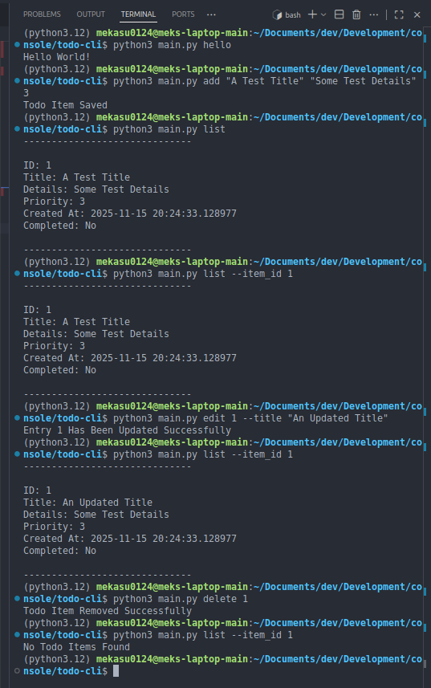

# Todo - Python Click CLI Application

> WARNING: This readme is subject to change/update at any time. Do keep frequent!

Table of Contents:
- [Introduction](#introduction)
- [How To Use](#how-to-use)
- [Issues](#issues)
- [Contributing](#contributing)
- [Licensing](#licensing)

## Introduction

Welcome to Todo CLI (Click Version). This is a simple cli application for keep track of your tasks. This application does not require an internet connection and all data is stored within a json file inside the applications file structure.

## How To Use

> NOTE: When using more than one word for the title or details, ensure to wrap them in "quotes" otherwise the program will only register the first word and error out on the rest

- Creating A New ToDo Item
  - <code>4 add "title" "details" priority_number</code>
  - Example:
    - <code>todo add "Some Test Title" "Some Other Details" 3</code>

- Editing A New ToDo Item
  |prefix|command|item_id: integer|argument/option|information|
  |-|-|-|-|-|
  |todo|edit|1|--title|following the flag --title, enter your new title surrounded by "quotes"|
  ||||--details|following the flag --details, enter your new details surrounded by "quotes"|
  ||||--priority|following the flag --priority, enter the new number for the priority level 1-3|
  ||||--is_completed|following the flag --is_completed, eneter either True or False for completion status|

- Deleting A ToDo Item
  - <code>todo delete item_id</code>
  - Example:
    - <code>todo delete 3</code>

- Listing All Todo Items
  - <code>todo list</code>

- List A Specific ToDo Item
  - <code>todo list item_id</code>
  - Example:
    - <code>todo list 3</code>

## Issues

If at any time you come into any issues with the code, please go to [the issues page](https://github.com/mek0124/Todo/issues) and create a new issue.

## Contributors

Anyone is welcome to contribute to the application.

Rules:
  - No Malicious Code
  - No Spaghetti Code
  - If you're apart of the discord server, do include your discord username in your forked commit to allow for easier communication

Instructions:
  - Fork the main branch
  - Commit to your fork only!
  - Allow up to 1 week for your contribution to be viewed and responded to
  - [Join the discord server](https://discord.gg/gQQwawtWmF) for easier communication and updates

## Licensing

This application is licensed under the Apache 2 License (subject to change at any time, check back regularly)
